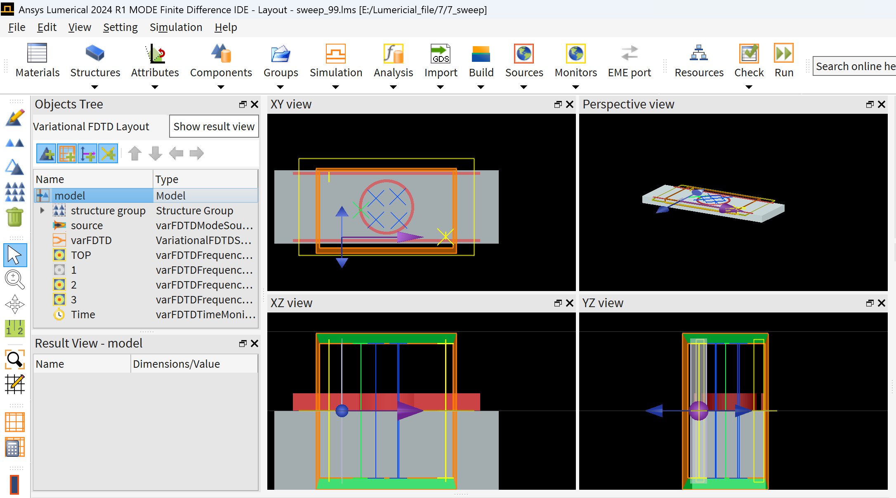

# MRR-Lumerical 硅光子器件建模与仿真

## Silicon Microring Resonator Simulation Based on Ansys Lumerical

本项目使用 **Ansys Lumerical MODE / varFDTD** 对硅基微环谐振器（Microring Resonator, MRR）进行建模与数值仿真。

项目主要研究微环谐振器中直波导与环形波导之间的倏逝场耦合、谐振光谱、环内电场分布，以及微环半径、耦合间隙等结构参数对器件光学性能的影响。

项目采用参数化 `Structure Group` 构建器件，使微环半径、波导宽度、耦合间隙和直波导长度等参数可以直接在 Lumerical Properties 面板中修改，便于后续进行参数扫描（Parameter Sweep）和结构优化。

---

# 1. 项目简介

微环谐振器（Microring Resonator, MRR）是一种典型的集成光子学器件，由环形波导和邻近的直波导构成。

当直波导中的光传播至微环附近时，由于波导模式的倏逝场重叠，一部分光可以耦合进入微环。

当光在微环中传播一周所积累的相位满足谐振条件时，环内光场发生相干增强，从而在输出端产生明显的透射谱变化。

本项目我独立完成的主要工作包括：

- 使用 Lumerical varFDTD 建立 SOI 微环谐振器模型；
- 使用 Structure Group 实现器件几何结构参数化；
- 建立 MRR 微环光子器件结构；
- 设置 Mode Source 激励波导基模；
- 使用 Frequency Domain Monitor 获取电磁场分布；
- 使用 Transmission Monitor 获取器件透射光谱；
- 在 1550 nm 通信波段附近寻找微环共振波长；
- 分析共振和非共振状态下的环内电场分布；
- 扫描微环半径、Gap 等参数对谐振特性的影响；
- 总结微环仿真过程中常见的建模和数值计算问题。

---

# 2. 项目背景

## 2.1 微环谐振器

微环谐振器通常由一个环形波导和一个或多个直波导组成。

当直波导与微环之间的距离足够小时，两者的倏逝场发生重叠，从而产生光学耦合。


> Figure 1. Microring Resonator 基本结构示意图


微环谐振器具有：

- 尺寸小；
- 易于片上集成；
- 波长选择性强；
- 较高 Q factor；
- 对折射率变化敏感；

等特点。

因此广泛应用于：

- 光学滤波器；
- WDM 波分复用；
- 光开关；
- 光调制器；
- 光学传感器；
- 非线性光学；
- 集成光子芯片。

---

## 2.2 SOI 平台

本项目采用典型的 Silicon-On-Insulator（SOI）结构。

核心波导材料为 Silicon，衬底材料为 SiO₂。

由于 Silicon 和 SiO₂ 之间具有较大的折射率差，可以形成较强的光场限制，因此能够实现亚微米尺寸的高密度集成光波导。

本项目采用的典型 Silicon 波导厚度为：

```text
H = 220 nm
```

工作波段主要位于：

```text
λ ≈ 1550 nm
```

# 3. 结构设计与参数设置

## 3.1 微环结构

本项目使用环形 Silicon 波导与直 Silicon Bus Waveguide 构成微环谐振器。

主要几何参数定义如下：

| Parameter | Symbol | Typical Value | Description |
|---|---:|---:|---|
| Ring radius | R | 3.5 μm | 微环中心线半径 |
| Waveguide width | W | 0.4 μm | 微环及直波导宽度 |
| Waveguide height | H | 0.22 μm | Silicon 波导厚度 |
| Coupling gap | Gap | 0.1 μm | 环与直波导边缘间距 |
| Bus length | L | 25 μm | 直波导长度 |
| Substrate height | Hsub | 3 μm | SiO₂ 衬底厚度 |

> 注：项目中的结构尺寸均采用 SI 单位写入 Lumerical Script，例如 `3.5 μm = 3.5e-6 m`。

---

## 3.2 微环内外半径

本项目中的 `ring_radius` 定义为微环波导的**中心线半径**。

因此：

```text
R_inner = R - W/2
R_outer = R + W/2
```

对于：

```text
R = 3.5 μm
W = 0.4 μm
```

得到：

```text
R_inner = 3.3 μm
R_outer = 3.7 μm
```

---

## 3.3 Gap 定义

Gap 定义为：

> 微环外边缘与 Bus Waveguide 内侧边缘之间的最短距离。

因此直波导中心位置满足：

```text
Y_bus = R_outer + Gap + W/2
```

即：

```text
Y_bus = R + W + Gap
```

对于：

```text
R   = 3.5 μm
W   = 0.4 μm
Gap = 0.1 μm
```

得到：

```text
Y_bus = 4.0 μm
```

这一点非常重要。如果直接使用中心半径计算 Gap，可能导致实际耦合间距与设计值不一致。

<!-- IMAGE PLACEHOLDER -->

> Figure 2. 微环半径、波导宽度与 Gap 定义

---

## 3.4 Structure Group 参数化

为了避免每次修改结构尺寸都重新修改 Script，本项目使用 Lumerical `Structure Group` 实现参数化建模。

主要 User Properties：

```text
ring_radius
wg_width
wg_height
gap
bus_length
substrate_height
```

推荐默认参数：

```text
ring_radius       = 3.5 μm
wg_width          = 0.4 μm
wg_height         = 0.22 μm
gap               = 0.1 μm
bus_length        = 25 μm
substrate_height  = 3 μm
```

修改 Structure Group 中的参数后，微环内外半径、Bus Waveguide 位置和衬底尺寸均自动重新计算。

<!-- IMAGE PLACEHOLDER -->

> Figure 3. Lumerical Structure Group Properties

这种方式非常适合后续 Parameter Sweep。

---

# 4. 理论基础与仿真结果

## 4.1 微环谐振条件

光进入微环后会沿环形波导循环传播。

当光传播一周后积累的相位满足整数倍 `2π` 时，不同 round trip 的光场发生相干叠加，形成微环谐振。

基本谐振条件为：

$$
m\lambda_{res}=n_{eff}L
$$

其中：

- $m$：谐振模式阶数；
- $\lambda_{res}$：谐振波长；
- $n_{eff}$：波导模式有效折射率；
- $L$：微环周长。

对于半径为 $R$ 的微环：

$$
L=2\pi R
$$

因此：

$$
m\lambda_{res}=n_{eff}2\pi R
$$

这意味着微环只会对某些特定波长产生明显的谐振增强。

---

## 4.2 倏逝场耦合

直波导中的光场并不是完全限制在 Silicon 内部，在波导边界之外仍存在指数衰减的倏逝场。

当微环靠近直波导时，两者倏逝场发生空间重叠，从而使光从 Bus Waveguide 耦合进入 Ring。

因此耦合强度与 Gap 密切相关：

```text
Gap ↓
→ Evanescent field overlap ↑
→ Coupling strength ↑
```

反之：

```text
Gap ↑
→ Evanescent field overlap ↓
→ Coupling strength ↓
```

因此 Gap 是微环设计中最重要的参数之一。

---

## 4.3 共振波长搜索

为了寻找微环的谐振波长，首先使用宽带 Source，例如：

```text
1500 nm ~ 1600 nm
```

然后在输出端使用 Transmission Monitor 获取：

$$
T(\lambda)
$$

当某个波长满足微环谐振条件时，Bus Waveguide 中的光与微环发生明显的能量交换，因此在 transmission spectrum 中出现明显的共振特征。

<!-- IMAGE PLACEHOLDER -->

> Figure 4. Microring Transmission Spectrum

在本项目的一组仿真结果中，在约：

```text
λ ≈ 1552 nm
```

附近观察到明显的窄带共振特征。

具体共振波长应根据最终高分辨率 wavelength sweep 的结果确定。

---

## 4.4 共振场分布

找到共振波长后，可以使用 Frequency Domain Profile Monitor 单独观察该波长附近的场分布。

例如：

```text
wavelength center = 1.55216 μm
wavelength span   = 0
frequency points  = 1
```

此时 Monitor 记录：

$$
E(x,y,\lambda=1552.16\text{ nm})
$$

用于观察该波长对应的微环电场分布。

<!-- IMAGE PLACEHOLDER -->

> Figure 5. Resonance wavelength electric field distribution

在非共振波长下，虽然仍可能存在一定的倏逝场耦合，但光进入微环后无法在多次 round trip 中保持相位匹配，因此不会产生明显的环内场增强。

在共振波长附近，环内光场发生相干叠加，因此可以观察到更加明显的环形电场分布。

---

# 5. 参数扫描与结论

## 5.1 Ring Radius Sweep

根据：

$$
m\lambda_{res}=n_{eff}2\pi R
$$

改变微环半径 $R$ 会改变光学路径长度，因此会改变 resonance wavelength。

总体趋势为：

```text
Ring Radius ↑
        ↓
Optical Path Length ↑
        ↓
Resonance Position Shift
```

因此可以通过改变微环半径调节器件工作波长。

<!-- IMAGE PLACEHOLDER -->

> Figure 6. Ring radius parameter sweep

---

## 5.2 Gap Sweep

Gap 主要控制 Bus Waveguide 与 Ring 之间的耦合强度。

一般情况下：

```text
Gap ↓
→ Coupling ↑
```

而：

```text
Gap ↑
→ Coupling ↓
```

但 Gap 并不是越小越好。

根据微环内部损耗和外部耦合强度之间的关系，器件可以处于：

```text
Under-coupling
Critical coupling
Over-coupling
```

三种典型状态。

其中 Critical Coupling 附近通常能够得到较深的 through-port resonance dip。

<!-- IMAGE PLACEHOLDER -->

> Figure 7. Gap parameter sweep

因此实际设计中需要通过 Gap Sweep 找到合适的耦合区域，而不是单纯追求最小 Gap。

---


## 5.4 仿真结论

本项目通过 Lumerical varFDTD 建立了参数化 Silicon Microring Resonator 模型。

仿真表明：

1. 微环只有在满足相位匹配条件的特定波长附近产生明显谐振；
2. Transmission Spectrum 可以用于寻找 resonance wavelength；
3. Ring Radius 主要影响光程和 resonance position；
4. Gap 对 Bus-Ring coupling strength 具有显著影响；
5. 通过 Structure Group 参数化可以方便地完成结构优化与参数扫描。

---

# 6. 常见问题

## Q1. 为什么直波导很亮，但微环里面几乎没有光？

这并不一定说明没有发生耦合。

常见原因包括：

### 1. 当前观察波长不在 resonance 上

微环只在特定波长满足：

$$
m\lambda=n_{eff}2\pi R
$$

因此首先应该扫描 transmission spectrum，找到准确的 resonance wavelength。

### 2. Field Monitor 没有记录共振波长

例如真实 resonance 是：

```text
1552.16 nm
```

但 TOP Monitor 记录：

```text
1521.6 nm
```

此时看到的自然是非共振状态下的场分布。

### 3. Gap 过大

Gap 过大会导致倏逝场重叠减弱，使 Bus-Ring coupling 非常弱。

### 4. Coupling Region Mesh 太粗

例如：

```text
Gap = 100 nm
```

如果 mesh size 也达到几十甚至上百纳米，则无法准确描述耦合区域。

建议在 coupling region 使用局部 mesh override，例如：

```text
dx <= 10~20 nm
dy <= 10~20 nm
```

---

## Q2. 为什么修改 Monitor 的波长，而不是 Source？

两者功能不同。

```text
Source
   ↓
决定系统中有什么波长的光

Monitor
   ↓
决定记录哪个波长的结果
```

如果 Source 已经覆盖：

```text
1500 ~ 1600 nm
```

那么 1552.16 nm 已经包含在 Source 中。

此时将 Field Monitor 设置到：

```text
1552.16 nm
```

只是为了提取：

$$
E(x,y,1552.16\text{ nm})
$$

并不会产生新的光。

---

## Q3. 为什么第一次仿真使用 Broadband Source？

因为在仿真之前通常不知道准确的 resonance wavelength。

因此先：

```text
Broadband Source
1500 ~ 1600 nm
        ↓
Transmission Spectrum
        ↓
Find Resonance
        ↓
λres
```

然后再针对 $\lambda_{res}$ 进行高分辨率仿真和场分布分析。

---

## Q4. 为什么 Transmission Monitor 出现负值？

Transmission 的符号可能与 Monitor 的法向方向和功率传播方向有关。

因此负值不一定表示“负的光功率”。

需要检查：

- Monitor orientation；
- propagation direction；
- power flow direction；
- 数据具体定义。

分析 spectrum 时应确保使用正确的 transmission quantity，而不是简单地把复数结果的 `Re` 当作最终功率透射率。

---

## Q5. 为什么 resonance 很尖，Field Monitor 却看不到？

可能是 Frequency Points 太少。

例如 resonance 位于：

```text
1552.16 nm
```

但 Monitor 只采样：

```text
1540 nm
1550 nm
1560 nm
```

那么 resonance 会被完全错过。

寻找 resonance 时应该增加 wavelength/frequency sampling resolution。

找到 resonance 后，可以单独设置：

```text
wavelength center = 1.55216 μm
wavelength span   = 0
frequency points  = 1
```

直接观察对应的场分布。

---

## Q6. 为什么 Gap 的计算不能直接使用 Ring Radius？

如果 `ring_radius` 定义的是中心线半径，那么微环外半径为：

$$
R_{outer}=R+\frac{W}{2}
$$

所以 Bus Waveguide 的中心位置应该为：

$$
Y_{bus}=R_{outer}+Gap+\frac{W}{2}
$$

即：

$$
Y_{bus}=R+W+Gap
$$

否则实际 edge-to-edge Gap 会与设置值不同。

---

## Q7. 为什么 Gap = 100 nm 时需要局部细网格？

因为耦合发生在一个非常小的空间区域。

如果：

```text
Gap = 100 nm
Mesh = 100 nm
```

整个 Gap 可能只有约一个网格单元，无法准确描述倏逝场。

因此 coupling region 通常需要比其他区域更细的 mesh。

---

## Q8. 为什么仿真时间太短会影响微环结果？

微环属于谐振结构。

光耦合进入 Ring 后需要经过多次 round trip，才能逐渐建立稳定的 resonant field。

如果 simulation time 太短：

```text
Source excitation
      ↓
Light enters ring
      ↓
Simulation ends too early
      ↓
Resonance has not fully built up
```

因此高 Q 微环通常需要更长的仿真时间，并应结合 auto shutoff 等条件判断仿真是否充分收敛。

---

# 7. Software

本项目主要使用：

- **Ansys Lumerical MODE**
- **varFDTD**
- **Lumerical Script (.lsf)**

---

# 8. Future Work

后续可以进一步研究：

- Resonance wavelength 自动提取；
- FSR (Free Spectral Range)；
- FWHM 自动计算；
- Q Factor 自动计算；
- Extinction Ratio；
- Critical Coupling 条件；
- Ring Radius Sweep；
- Gap Sweep；
- Waveguide Width Sweep；
- Add-Drop Microring Resonator；
- 微环折射率传感；
- 热光调谐；

---

# 9. License

This project is intended for learning, research and integrated photonics simulation.

---

## Author

**MRR-Lumerical**

Silicon Photonics / Microring Resonator / Lumerical varFDTD
