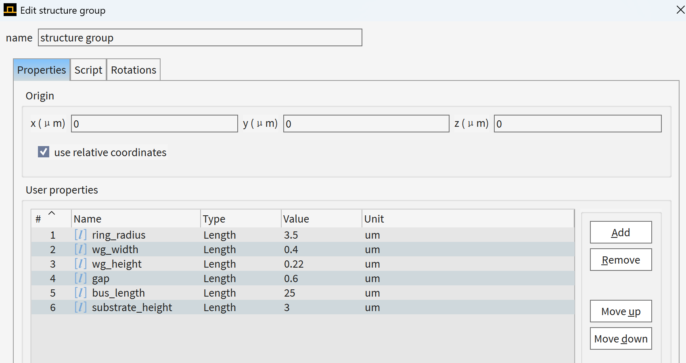
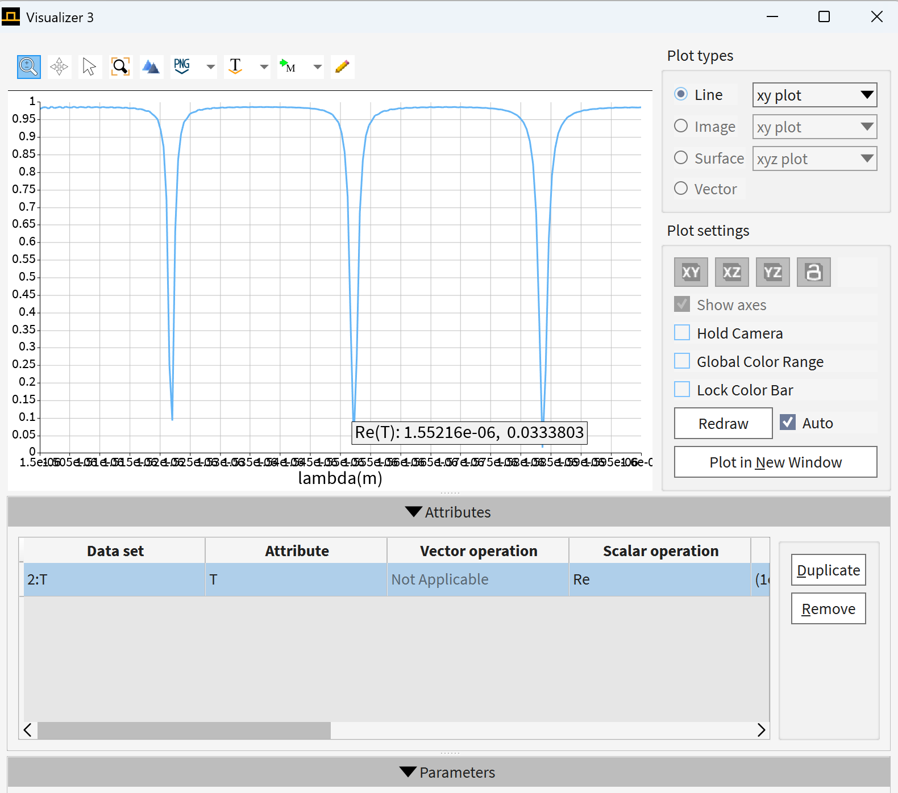
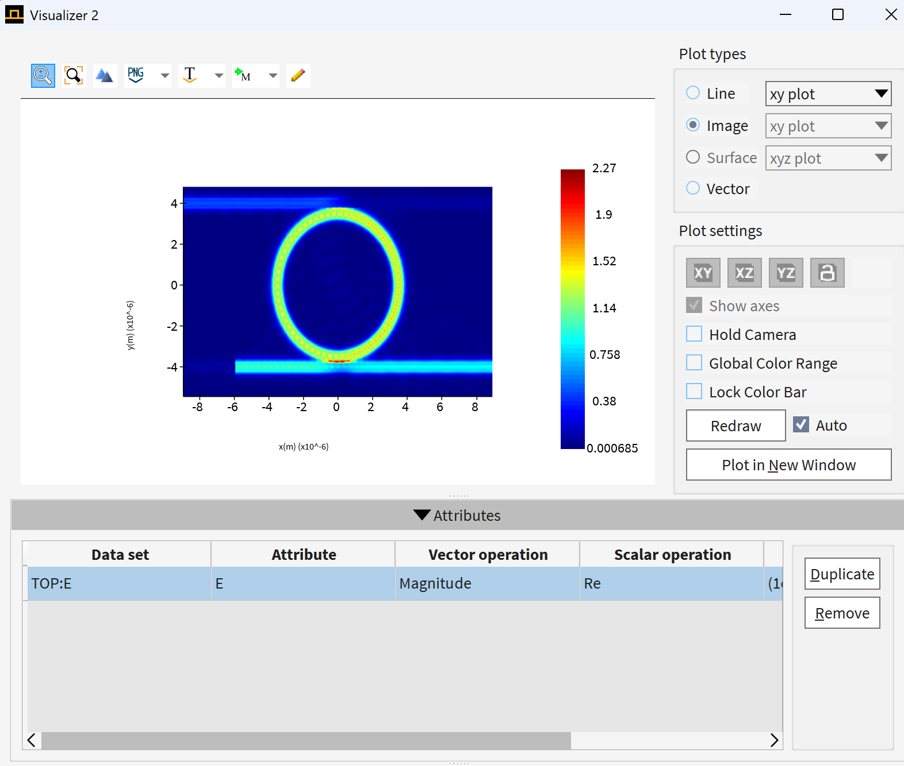
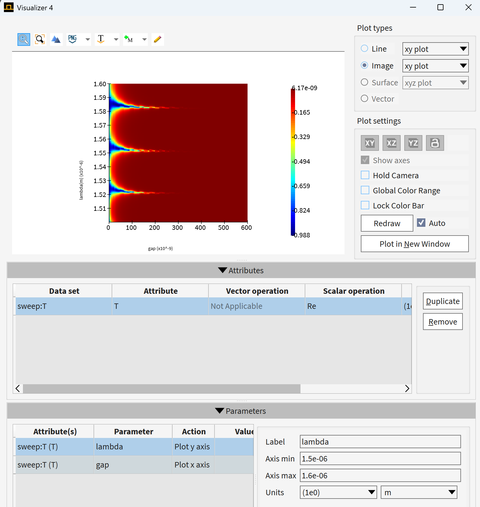
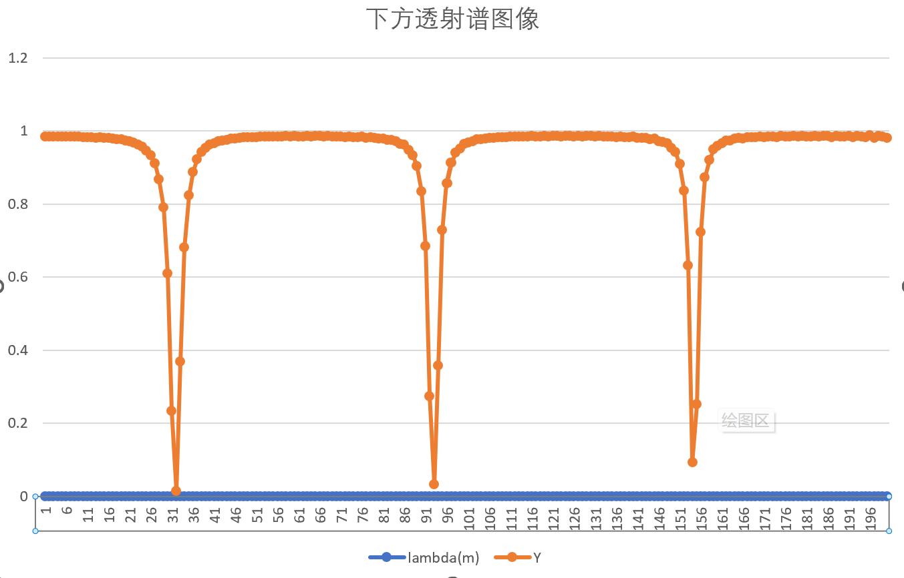

# MRR-Lumerical 硅光子器件建模与仿真

## Silicon Microring Resonator Simulation Based on Ansys Lumerical

本项目使用 **Ansys Lumerical MODE / varFDTD** 对硅基微环谐振器（Microring Resonator, MRR）进行建模与数值仿真。

项目主要研究微环谐振器中直波导与环形波导之间的倏逝场耦合、谐振光谱、环内电场分布，以及微环半径、耦合间隙等结构参数对器件光学性能的影响。

项目采用参数化 `Structure Group` 构建器件，使微环半径、波导宽度、耦合间隙和直波导长度等参数可以直接在 Lumerical Properties 面板中修改，便于后续进行参数扫描（Parameter Sweep）和结构优化。

---

# 1. 项目背景

## 1.1 微环谐振器

微环谐振器通常由一个环形波导和一个或多个直波导组成。

当直波导与微环之间的距离足够小时，两者的倏逝场发生重叠，从而产生光学耦合。


> Figure 1. Microring Resonator 基本结构示意图


微环谐振器具有：

- 尺寸小；
- 易于片上集成；
- 波长选择性强；
- 较高 Q factor；
- 对折射率变化敏感；

等特点。

因此广泛应用于：

- 光学滤波器；
- WDM 波分复用；
- 光开关；
- 光调制器；
- 光学传感器；
- 非线性光学；
- 集成光子芯片。

---

## 1.2 SOI 平台

本项目采用典型的 Silicon-On-Insulator（SOI）结构。

核心波导材料为 Silicon，衬底材料为 SiO₂。

由于 Silicon 和 SiO₂ 之间具有较大的折射率差，可以形成较强的光场限制，因此能够实现亚微米尺寸的高密度集成光波导。

本项目采用的典型 Silicon 波导厚度为：

```text
H = 220 nm
```

工作波段主要位于：

```text
λ ≈ 1550 nm
```

# 2. 结构设计与参数设置

## 2.1 微环结构

本项目使用环形波导与直波导构成微环谐振器。

主要几何参数定义如下：

| Parameter | Symbol | Typical Value | Description |
|---|---:|---:|---|
| Ring radius | R | 3.5 μm | 微环中心线半径 |
| Waveguide width | W | 0.4 μm | 微环及直波导宽度 |
| Waveguide height | H | 0.22 μm | Silicon 波导厚度 |
| Coupling gap | Gap | 0.1 μm | 环与直波导边缘间距 |
| Bus length | L | 25 μm | 直波导长度 |
| Substrate height | Hsub | 3 μm | SiO₂ 衬底厚度 |

> 注：项目中的结构尺寸均采用 SI 单位写入 Lumerical Script，例如 `3.5 μm = 3.5e-6 m`。

---

## 3.2 微环内外半径

本项目中的 `ring_radius` 定义为微环波导的**中心线半径**。

因此：

```text
R_inner = R - W/2
R_outer = R + W/2
```

对于：

```text
R = 3.5 μm
W = 0.4 μm
```

得到：

```text
R_inner = 3.3 μm
R_outer = 3.7 μm
```

---

## 3.3 Gap 定义

Gap 定义为：

> 微环外边缘与 Bus Waveguide 内侧边缘之间的最短距离。

因此直波导中心位置满足：

```text
Y_bus = R_outer + Gap + W/2
```

即：

```text
Y_bus = R + W + Gap
```

对于：

```text
R   = 3.5 μm
W   = 0.4 μm
Gap = 0.1 μm
```

得到：

```text
Y_bus = 4.0 μm
```

这一点非常重要。如果直接使用中心半径计算 Gap，可能导致实际耦合间距与设计值不一致。


---

## 3.4 Structure Group 参数化

为了避免每次修改结构尺寸都重新修改 Script，本项目使用 Lumerical `Structure Group` 实现参数化建模。

推荐默认参数：

> Figure 2. Parameter settings

修改 Structure Group 中的参数后，微环内外半径、Gap宽度均自动重新计算。

这种方式非常适合后续 Parameter Sweep。

---

# 4. 理论基础与仿真结果

## 4.1 微环谐振条件

光进入微环后会沿环形波导循环传播。

当光传播一周后积累的相位满足整数倍 `2π` 时，不同 round trip 的光场发生相干叠加，形成微环谐振。

基本谐振条件为：

$$
m\lambda_{res}=n_{eff}L
$$

其中：

- $m$：谐振模式阶数；
- $\lambda_{res}$：谐振波长；
- $n_{eff}$：波导模式有效折射率；
- $L$：微环周长。

对于半径为 $R$ 的微环：

$$
L=2\pi R
$$

因此：

$$
m\lambda_{res}=n_{eff}2\pi R
$$

这意味着微环只会对某些特定波长产生明显的谐振增强。

---

## 4.2 倏逝场耦合

直波导中的光场并不是完全限制在波导内部，在波导边界之外仍存在指数衰减的倏逝场。

当微环靠近直波导时，两者**倏逝场**发生空间重叠，从而使光从直波导耦合进入微环中。

因此耦合强度与 Gap 密切相关：

```text
Gap ↓
→ 倏逝场（Evanescent field overlap） ↑
→ 耦合强度（Coupling strength） ↑
```

因此 Gap 是微环设计中最重要的参数之一。

---

## 4.3 共振波长搜索

为了寻找微环的谐振波长，先仿真一段范围内的波长，例如本次我们选取的波长范围是：

```text
1500 nm ~ 1600 nm
```

然后在输出端使用 Transmission Monitor 获取：

$$
T(\lambda)
$$

当某个波长满足微环谐振条件时，Bus Waveguide 中的光与微环发生明显的能量交换，因此在 transmission spectrum 中出现明显的共振特征。


> Figure 3. 谐振谱

在一组仿真结果中，我们可以明显看到在约：

```text
λ ≈ 1552 nm
```

附近观察到明显的共振特性。

---

## 4.4 共振场分布

找到共振波长后，可以调整mode source的波长为 λ ≈ 1552 nm 单独观察该波长附近的场分布。


此时 Monitor 记录：

$$
E(x,y,\lambda=1552.16\text{ nm})
$$

用于观察该波长对应的微环电场分布。


> Figure 4. 电场图

在非共振波长下，虽然仍可能存在一定的倏逝场耦合，但光进入微环后无法多次保持相位匹配，因此不会产生明显的环内场增强。

但是在共振波长附近，我们可以明显看到环内光场发生相干叠加，观察到更加明显的环形电场分布。

---

# 5. 参数扫描与数据分析

---

## 5.1 Gap Sweep

Gap 主要控制 直波导 与 微环 之间的耦合强度。

一般情况下：

```text
Gap ↓
→ Coupling ↑
```
但 Gap 并不是越小越好。

根据微环内部损耗和外部耦合强度之间的关系，器件可以处于：

```text
Under-coupling
Critical coupling
Over-coupling
```
因此实际设计中需要通过 Gap Sweep 找到合适的耦合区域，而不是单纯追求最小 Gap。


> Figure 5. gap_0-0.6um扫参结果

---

## 5.2 数据分析
我截取FDTD的透射谱图像，如下：


> Figure 3. 谐振谱

使用Python进行画图和数据分析，图像如下：


> Figure 6. 谐振谱

本次仿真针对微环谐振器（MRR）1500–1600 nm光通信波段开展透射光谱扫描，提取三组数据，完成自由光谱范围（FSR）、半高全宽（FWHM）、品质因子（Q值）核心光学参数的计算与性能分析。
5.2.1. 谐振波长与透射率
提取波段内三组有效谐振点，统计各谐振波长对应的最低透射率，表征微环谐振凹陷深度：
谐振波长 (nm)
最低点透射率 Tmin
λ = 1521.99nm T = 0.09214

λ = 1552.16nm T = 0.03338

λ = 1583.55nm T = 0.01494

5.2.2. 自由光谱范围 FSR 计算
自由光谱范围（FSR）是微环谐振器件的核心性能指标，定义**为相邻两个谐振波长的间隔**，直接决定器件的有效工作带宽。本次基于实测谐振波长完成FSR计算：

FSR 计算结果
1521.99 nm → 1552.16 nm
**FSR = 30.17 nm**
1552.16 nm → 1583.55 nm
**FSR = 31.39 nm**
平均自由光谱范围（平均FSR）：30.78 nm

5.2.3. 1552nm 通信波段谐振点 Q 值精细分析
1550nm波段为光通信核心工作波段，本次选取1552.16nm最优谐振点，开展高精度线宽与品质因子计算，参数及计算过程如下：
- 谐振中心波长：1552.16 nm
- 谐振最低点透射率：0.03338
- 器件背景平直透射率：0.98103
- 谐振半陷透射阈值（半高深）：0.50721
- 半高宽左截止波长：1551.456 nm
- 半高宽右截止波长：1552.954 nm
- 谐振线宽（FWHM）：1.499 nm
品质因子Q值是衡量微环谐振器损耗与谐振性能的关键指标，计算公式为：谐振中心波长与谐振线宽的比值
**Q = 谐振波长 / 半高全宽（FWHM）= 1552.16 / 1.499 ≈ 1036**
5.2.4. 仿真结果总结
本次搭建的硅基微环谐振器参数化仿真模型性能稳定，在1500–1600nm光通信波段可实现有效谐振响应。器件平均自由光谱范围达30.78nm，核心通信波段谐振Q值可达1036，谐振凹陷深度优异、损耗特性良好，符合常规无源硅光微环器件的设计指标，能够满足光滤波、光学谐振传感、光信号处理等基础硅光应用场景的使用需求。

---

## 5.3 仿真结论

本项目通过 Lumerical varFDTD 建立了参数化 Silicon Microring Resonator 模型。

仿真表明：

1. 微环只有在满足相位匹配条件的特定波长附近产生明显谐振，在本次仿真的默认参数中λ ≈ 1552.16 nm为谐振波长能观察到明显的耦合现象；
2. Ring Radius 主要影响光程和 resonance position；
3. Gap 对 Bus-Ring coupling strength 具有显著影响；
4. 通过 Structure Group 参数化可以方便地完成结构优化与参数扫描。
   

---

# 6. Software

本项目主要使用：

- **Ansys Lumerical MODE**
- **varFDTD**
- **Lumerical Script (.lsf)**


---

# 7. License

This project is intended for learning, research and integrated photonics simulation.

---

## Author

**MRR-Lumerical**

Silicon Photonics / Microring Resonator / Lumerical varFDTD
